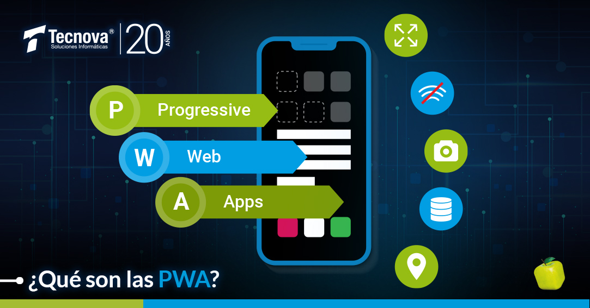
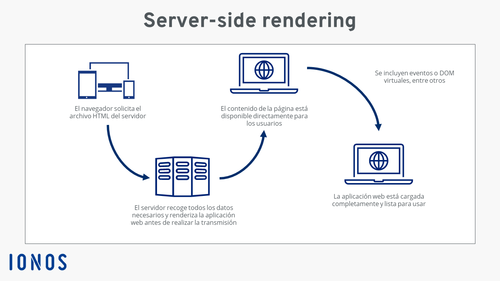
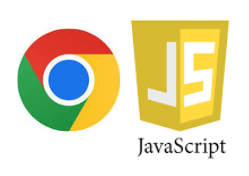
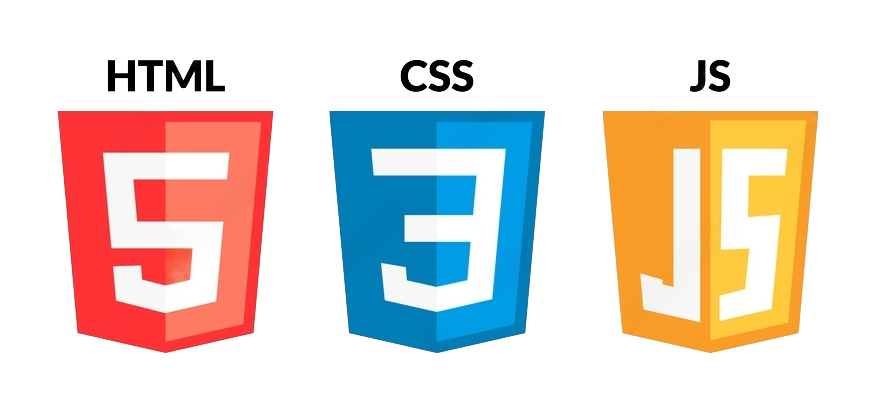
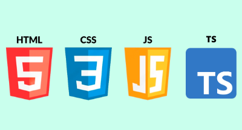
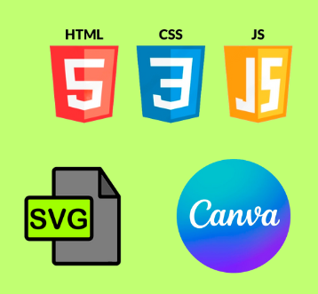

# - *ÍNDICE* -

- ####  1. Modelos de Programación en Arquitectura Web.
    - ***-** Investigación de los modelos cliente/servidor más comunes*
    - ***-** Identificación de ejemplos de aplicaciones web que utilizan cada modelo.*

- #### 2. Mecanismos de Ejecución de Código en un Navegador Web. Capacidades y Limitaciones de Ejecución. Compatibilidad con Navegadores Web.
    - ***-** Estudio de cómo se ejecuta el código JavaScript en un navegador*
    - ***-** Evaluación de las diferencias de compatibilidad entre navegadores.*
    - ***-** Resolución de problemas de compatibilidad en una aplicación web.*

- #### 3. Lenguajes de Programación en Entorno Cliente.
    - ***-** Investigación de lenguajes como JavaScript, TypeScript, y otros.*
    - ***-** Comparación de sus características y aplicaciones.*

- ### 4. Características de los Lenguajes de Script. Ventajas y Desventajas.
    - ***-** Análisis de las ventajas y desventajas de la programación en lenguajes de script sobre la programación tradicional.*

- ### 5. Tecnologías y Lenguajes Asociados. Integración del Código con las Etiquetas HTML.
    - ***-** Exploración de tecnologías como CSS y HTML5.*
    - ***-** Creación de una pequeña aplicación web integrando código JavaScript de diferentes maneras.*

- ### 6. Herramientas de Programación.
    - ***-** Uso de herramientas como Visual Studio Code, Chrome DevTools, etc.*

---
### 1. Modelos de Programación en Arquitectura Web.
 *- Investigación de los modelos cliente/servidor más comunes*

- **Single Page Application (SPA)**:  es una aplicación web que carga todo su contenido en una sola página sin recargar la página completa al navegar.

- **Arquitectura de Aplicaciones Web Progresivas (PWA)**: es una única página que proporciona capacidades offline para tu aplicación web. 

- **Arquitectura de Renderizado del Lado Servidor (SSR)**:  renderizado de las páginas web desde un servidor backend después de que un usuario las solicite.

 *- Identificación de ejmplos de aplicaciones que utilizan cada modelo*

- **Single Page Application**: algunos ejemplos de una SPA son Gmail, LinkedIn o Twitter.

- **Aplicaciones Web Progresivas**: hay ejemplos de PWA como Google Maps, Uber, Instagram, Facebook, etc.

- **Renderizado del Lado Servidor**: ejemplos son principalmente blogs o sitios web de comercio electrónico.

---
### 2. Mecanismos de Ejecución de Código en un Navegador Web. Capacidades y Limitaciones de Ejecución. Compatibilidad con Navegadores Web.

 *- Estudio de como se ejecuta el código JavaScript en un navegador*

En Chrome podemos crear snippets.
Para crear un snippet en Chrome podemos usar la consola del navegador dentro de la sección Sources / Snippets / New Snippet, elegimos el nombre que queramos y escribimos en la consola console.log (“Hello World”);
Por último presionamos CTRL+Enter o CMD+Enter para ejecutar el programa y ver la salida desde la consola.

 *- Evaluación de las difrencias de compatibilidad entre navegadores*

Para conseguir que nuestra página web se vea correctamente en el navegador influye la compatibiliad entre los navegadores, por eso vemos una tabla con los mas usados en 2023.

| 2023      | Chrome | Safari | Edge | Firefox | Opera |
| --------- | -----: | -----: | ---: | ------: | ----: |     
| Agosto    |   66,1%|     13%|  4,6%|     3,9%|   1,1%|
| Julio     |   72,8%|   13,5%|  2,7%|     2,5%|   1,2%|
| Junio     |     76%|     11%|  2,6%|     2,5%|     1%|
| Mayo      |   75,7%|   10,8%|  3,3%|     2,6%|     1%|

Estos datos son obtenidos gracias a https://www.w3counter.com/globalstats.php

*-Resolución de problemas de compatibilidad en una aplicación web.*
- Validar los archivos CSS y HTML ya que pueden ser un gran problema para los desarrolladores. 
- No incluir la línea más básica del HTML (Doctype)
- Investigar si la función de JavaScripr es compatible con las versiones de los navegadores más antiguos y puedes hacer uso para ello de la herramienta Caniuse.

---
### 3. Lenguajes de Programación en Entonrno Cliente.
*- Investigación de lenguajes como JavaScript, Typescript y otros*
- **JavaScript**: es un lenguaje de programación ligero, interpretado o compilado justo-a-tiempo con funciones de primera clase y su usa para crear interactividad dinámica en los sitios web.

- **HTML**: es el lenguaje con el que se define el contenido de las páginas web. 

- **CSS**: es un lenguaje que maneja el diseño y presentación de las páginas web, es decir, como lucen cuando el usuario las visita. 

- **TypeScript**: es un lenguaje de programación fuertemente tipado que está basado en JavaScript y le brinda mejores herramientas a cualquier escala. 

*-Comparación de sus caracteristicas y aplicaciones*
*Caracteristicas de JavaScript y aplicaciones.*
- JavaScript es un lenguaje interpretado, lo que significa que no necesita ser compilado antes de ejecutarse.

- JavaScript es un lenguaje orientado a objetos utiliza prototipos para poder definir los objetos. 

- JavaScript es un lenguaje muy sencillo, tanto que no hace falta tener unos amplios conocimientos de programación para poder hacer un programa en JavaScript.

- Al ser un lenguaje interpretado le permite tener múltiples interpretes en distintos navegadores como Chrome, Safari u Opera, ... 

Se usa en el Desarrollo de aplicaciones Web, Desarrollo web, desarrollo de juegos en línea, etc. 

*Caracteristicas de HTML y aplicaciones.*
- No es necesario estar en línea para que el lenguaje HTML funcione correctamente.

- Es muy fácil de usar y entender para cualquier persona haya o no programado anteriormente.

- Es reconocido y admitido por cualquier tipo de explorador web.

- Es multiplataforma, por lo que se puede acceder desde cualquier lugar y dispositivo.

Se usa para la estructuración de contenido de una página web.

*Caracteristicas de CSS y aplicaciones.*
- Es utilizable en todos los navegadores y plataforma ya que es un lenguaje popular para dar formato a los sitios web.

- Optimiza el funcionamiento de las páginas web al separar el código de contenido y de estilo.

- Permite personalizar totalmente la apariencia de las páginas. 

CSS se utiliza para controlar el diseño y la maquetación de una página web.

*Caracteristicas de Typescript y aplicaciones.*
- TypeScript admite todos los elementos de JavaScript.

- TypeScript se fundamenta en JavaScript, por ello te será muy fácil utilizarlo si ya tienes conocimientos sobre JavaScript. 

- TypeScript se puede ejecutar en cualquier navegador, dispositivo o sistema operativo.

- TypeScript tiene todas las herramientas de un lenguaje de programación orientado a objetos como clases, interfaces, herencia, módulos, etc.

Se utiliza principalmente para el desarrollo de aplicaciones web y proyectos de software en general.

---
### 4. Caracteristicas de los Lenguajes de Script. Ventajas y Desventajas.
*-Análisis de las ventajas y desventajas de la programación en lenguajes de script sobre la programación tradicional.*

*Ventajas de la programación en lenguajes de script:*

- **Fácil integración.** Los lenguajes de script suelen ser compatibles con otras tecnologías y sistemas.

- **Rápido Desarrollo.** La programación en lenguajes de script tiende a ser más rápida debido a la sintaxis precisa y a las bibliotecas y marcos de trabajo disponibles.

- **Facilidad de Aprendizaje.** Los lenguajes de script suelen ser más sencillos de aprender y utilizar en comparación con lenguajes de programación de bajo nivel.

- **Amplia Comunidad y Soporte.** Los lenguajes de script suelen tener comunidades de desarrolladores, por lo que es más sencillo encontrar ayuda, recursos, etc.

*Desventajas de la programación en lenguajes de script:*

- **Dependencias Externas.** Los proyectos en lenguajes de script a menudo dependen de bibliotecas y módulos externos.

- **Rendimiento.** Los lenguajes de script suelen ser más lentos en términos de rendimiento en comparación con lenguajes de programación compilados como C++ o Java.

- **Mayor Uso de Recursos.** Los lenguajes de script a menudo consumen más recursos del sistema en comparación con lenguajes compilados.

- **Tamaño de Ejecutables.** Los scripts y las aplicaciones escritas en lenguajes de script tienden a tener archivos ejecutables más grandes en comparación con aplicaciones nativas.

---
### 5. Tecnologías y Lenguajes Asociados. Integración del Código con las Etiquetas HTML.

*-Exploración de tecnologías como CSS y HTML5.*

HTML5 es un lenguaje de marcas que permite estructura y presentar contenido en la web.

- **CSS.** Nos permite dar estilo y belleza a nuestras paginas web.

- **JavaScript.** Con JavaScript vamos a poder hacer nuestras páginas interactivas y dinámicas.

- **SVG.** Esta tecnología permite crear gráficos y animaciones vectoriales en la web.

- **Canvas.** Nos permite crear gráficos y animaciones usando JavaScript.

Estas son algunas de las tecnologías complementarias de HTML5 que nos permiten poder llevar nuestras páginas web a un nivel superior.

*-Creación de una pequeña aplicación web integrando código JavaScript de diferentes maneras.*

- Aplicación integrando JavaScript de 2 formas distintas.

JavaScript dentro del HTML.
~~~
<!DOCTYPE html>
<html>
<head>
    <meta charset="UTF-8">
    <title>App Saludo</title>
</head>
<body>
    <h1>App Saludo</h1>
    <input type="text" id="name" placeholder="Ingresa tu nombre">
    <button onclick="saludar()">Saludar</button>
    

    
</body>
</html>
~~~

JavaScript en un archivo externo.
~~~
<!DOCTYPE html>
<html>
<head>
    <title>App Saludo</title>
</head>
<body>
    <h1>App Saludo</h1>
    <input type="text" id="name" placeholder="Ingresa tu nombre">
    <button onclick="saludar()">Saludar</button>
    

    
</body>
</html>
~~~

---
### 6. Herramientas de Programación. 
*- Uso de herramientas como Visual Studio Code, Chrome DevTools, etc.*

- **Visual Studio Code.** Es un editor de código abierto que se ejecuta en Windows, Linux y macOS. 

*- Algunas características claves de Visual Studio Code*

- **Soporte a los mejores lenguajes de programación.** Esta herramienta de desarrollo web funciona con varios lenguajes, incluidos C++, JavaScript y Python.

- **Tiene una amplia biblioteca de extensiones.** Hay varios temas y plugin disponibles en su Marketplace.

- **Resaltado de sintaxis.** Muestra el código en diferentes colores y fuentes según las palabras clave y el lenguaje de programación.

- **Chrome Developer Tools.** Son un conjunto de herramientas de edición y depuración web integradas en el navegador Google Chrome. 

*- Algunas características claves de Chrome Developer Tools*

- **Anulaciones locales.** Guarda los cambios que hayas realizado en cualquier página web en tu computadora local y anula automáticamente sus datos.

- **Características del diseño web.** Los diseñadores web pueden verificar varios diseños de páginas web.

- **Herramientas de diagnóstico.** Ve el uso de memoria de una página web con el Administrador de tareas de Chrome.

- **GitHub.** Es un servicio de alojamiento de repositorio de Git basado en la nube y de código abierto que ofrece una interfaz gráfica basada en la web.

*- Algunas características claves de GitHub*

- **Solicitudes de extracción y revisión de código.** Con GitHub, puedes asignar hasta 10 personas para trabajar en un problema específico o una solicitud de extracción. 

- **Amplias funciones de seguridad.** Cuenta con una herramienta de escaneo de código para identificar fallas de seguridad 

- **Automatización.** Con GitHub, puedes automatizar tareas como la CI/CD, pruebas, gestión de proyectos e incorporación de nuevos miembros.

---
# - Bibliografía -
