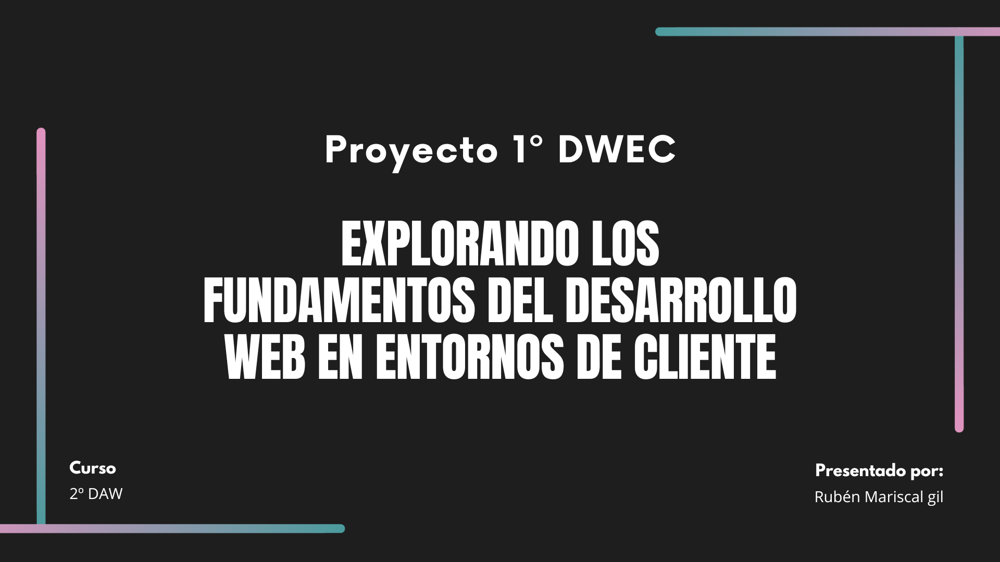

###### Rubén Mariscal Gil 2ºDAW

###### Proyecto 1 DWEC

# - *ÍNDICE* -

- ####  1. Modelos de Programación en Arquitectura Web.
    - ***-** Investigación de los modelos cliente/servidor más comunes*
    - ***-** Identificación de ejemplos de aplicaciones web que utilizan cada modelo.*

- #### 2. Mecanismos de Ejecución de Código en un Navegador Web. Capacidades y Limitaciones de Ejecución. Compatibilidad con Navegadores Web.
    - ***-** Estudio de cómo se ejecuta el código JavaScript en un navegador*
    - ***-** Evaluación de las diferencias de compatibilidad entre navegadores.*
    - ***-** Resolución de problemas de compatibilidad en una aplicación web.*

- #### 3. Lenguajes de Programación en Entorno Cliente.
    - ***-** Investigación de lenguajes como JavaScript, TypeScript, y otros.*
    - ***-** Comparación de sus características y aplicaciones.*

- ### 4. Características de los Lenguajes de Script. Ventajas y Desventajas.
    - ***-** Análisis de las ventajas y desventajas de la programación en lenguajes de script sobre la programación tradicional.*

- ### 5. Tecnologías y Lenguajes Asociados. Integración del Código con las Etiquetas HTML.
    - ***-** Exploración de tecnologías como CSS y HTML5.*
    - ***-** Creación de una pequeña aplicación web integrando código JavaScript de diferentes maneras.*

- ### 6. Herramientas de Programación.
    - ***-** Uso de herramientas como Visual Studio Code, Chrome DevTools, etc.*

---

# Explorando los Fundamentos del Desarrollo Web en Entornos de Cliente

### 1. Modelos de Programación en Arquitectura Web.

La arquitectura web consiste en la planificación y diseño de los componentes técnicos, funcionales y visuales de un sitio web, antes de que sea diseñado, desarrollado e implementado.

 *- Investigación de los modelos cliente/servidor más comunes*

- **Single Page Application (SPA)**: consiste en una única página que recoge todo el contenido de forma que el usuario una vez accede a la aplicación, no necesita navegar a otra página web.                                                                           Ventajas de las SPA, podemos construir aplicaciones web con muchas interacciones, optimizar las SPA no supone gran impacto en el rendimiento.
- **Arquitectura de Aplicaciones Web Progresivas (PWA)**: se basa en una única página que proporciona capacidades offline para tu aplicación web. Al igual que las SPA, las PWA son fluidas y sin fisuras.                                                                              Ventajas de la arquitectura PWA, las aplicaciones se ejecutan con mucha fluidez y son compatibles entre plataformas, los desarrolladores pueden acceder al acceso sin conexión y a las API de los dispositivos.
- **Arquitectura de Renderizado del Lado Servidor (SSR)**: consiste en el renderizado de las páginas web desde un servidor backend después de que un usuario las solicite. Las aplicaciones SSR son muy populares entre los blogs y sitios web de comercio electrónico.Ventajas de la arquitectura SSR, la carga de la primera página es casi instantánea en la mayoría de los casos, puedes combinarla con un servicio cache para mejorar aun mas el rendimiento de tu aplicación.

 *- Identificación de ejmplos de aplicaciones que utilizan cada modelo*

- **Single Page Application**: algunos ejemplos de una SPA son Gmail, LinkedIn o Twitter y la carga entre vistas es extremadamente rápidas.

- **Aplicaciones Web Progresivas**: hay ejemplos de PWA como Google Maps, Uber, Instagram, Facebook, etc.

- **Renderizado del Lado Servidor**: ejemplos son principalmente blogs o sitios web de comercio electrónico debido a la gestión de enlaces.

### 2. Mecanismos de Ejecución de Código en un Navegador Web. Capacidades y Limitaciones de Ejecución. Compatibilidad con Navegadores Web.

 *- Estudio de como se ejecuta el código JavaScript en un navegador*

En Chrome podemos crear snippets que son fragmentos pequeños de códigos y nos permiten ejecutar código JavaScript en nuestro navegador.

Para crear un snippet en Chrome podemos usar la consola del navegado dentro de la sección Sources / Snippets / New Snippet, elegimos el nombre que queramos y escribimos en la consola console.log (“Hello World”);

Por último presionamos CTRL+Enter o CMD+Enter para ejecutar el programa y ver la salida desde la consola.

 *- Evaluación de las difrencias de compatibilidad entre navegadores*

De entre todos los navegadores que existen a día de hoy vemos cuales son los mas usados por los usuarios en pleno 2023 teniendo en cuenta el apartado web, es importante una la compatibilidad de los mismos ya que no en todos los navegadores nuestra web se ve de la misma manera.

| 2023      | Chrome | Safari | Edge | Firefox | Opera |
| --------- | -----: | -----: | ---: | ------: | ----: |     
| Agosto    |   66,1%|     13%|  4,6%|     3,9%|   1,1%|
| Julio     |   72,8%|   13,5%|  2,7%|     2,5%|   1,2%|
| Junio     |     76%|     11%|  2,6%|     2,5%|     1%|
| Mayo      |   75,7%|   10,8%|  3,3%|     2,6%|     1%|

Estos datos son obtenidos gracias a https://www.w3counter.com/globalstats.php

*-Resolución de problemas de compatibilidad en una aplicación web.*
- Validar los archivos CSS y HTML ya que pueden ser un gran problema para los desarrolladores. Esto se debe al que el código es leído y cada navegador lo gestiona de una forma distinta y cualquier error produce fallos o problemas.

- No incluir la línea más básica del HTML (Doctype) puede ser el causante de errores a la hora de representar la página web. Aunque muchos navegadores no comprueban el Doctype los mas antiguos si lo hacen. La solución es muy simple comprobar si el HTML incluye el Doctype.

- Los problemas de compatibilidad de JavaScript se puede generar al intentar usar funciones actuales de JavaScript en navegadores más antiguos u obsoletos.
Para tratar de solucionarlos debemos de investigar si la función es compatible con las versiones de los navegadores más antiguos y puedes hacer uso para ello de la herramienta Caniuse.
Puedes usar herramientas como Babel for JavaScript Transpilling para poder convertir el código JavaScript utilizando las ultimas funciones siendo adaptadas a los navegadores más antiguos.

### 3. Lenguajes de Programación en Entonrno Cliente.
*- Investigación de lenguajes como JavaScript, Typescript y otros*
- **JavaScript**: es un lenguaje de programación ligero, interpretado o compilado justo-a-tiempo con funciones de primera clase que se puede aplicar a un documento HTML y usarse para crear interactividad dinámica en los sitios web.

- **HTML**: es el lenguaje con el que se define el contenido de las páginas web. Se trata de un conjunto de etiquetas que sirven para definir texto y otros elementos que compondrán una página web como imágenes, videos, etc.

- **CSS**: es un lenguaje que maneja el diseño y presentación de las páginas web, es decir, como lucen cuando el usuario las visita. Funciona junto al lenguaje HTML que se encarga del contenido básico de los sitios.

- **TypeScript**: es un lenguaje de programación fuertemente tipado que está basado en JavaScript y le brinda mejores herramientas a cualquier escala. 

*-Comparación de sus caracteristicas y aplicaciones*
*Caracteristicas de JavaScript y aplicaciones.*
- JavaScript es un lenguaje interpretado, lo que significa que no necesita ser compilado antes de ejecutarse. Los navegadores web pueden interpretar y ejecutar código JavaScript directamente.

- JavaScript es un lenguaje orientado a objetos utiliza prototipos para poder definir los objetos. Básicamente define un objeto como prototipo el cual se utiliza como base para poder definir nuevos objetos.

- JavaScript es un lenguaje muy sencillo, tanto que no hace falta tener unos amplios conocimientos de programación para poder hacer un programa en JavaScript. El hecho de poder desarrollar con JavaScript tanto aplicaciones del lado cliente como del lado servidor hace que sea un lenguaje muy extendido entre los desarrolladores.

- Al ser un lenguaje interpretado y que se ejecuta tanto en el lado cliente como servidor le permite tener múltiples interpretes en distintos navegadores como Chrome, Safari u Opera, ... Los cuales se ejecutan en diferentes sistemas operativos como Windows, Mac o Linux. 

Se usa en el Desarrollo de aplicaciones Web, Desarrollo web, desarrollo de juegos en línea, etc. 

*Caracteristicas de HTML y aplicaciones.*
- No es necesario estar en línea para que el lenguaje HTML funcione correctamente, ya que se puede codificar una página web sin conexión alguna.

- Es muy fácil de usar y entender para cualquier persona haya o no programado anteriormente.

- Es reconocido y admitido por cualquier tipo de explorador web.

- Es multiplataforma, por lo que se puede acceder desde cualquier lugar y dispositivo.

Se usa para la estructuración de contenido de una página web.

*Caracteristicas de CSS y aplicaciones.*
- Permite el apilamiento de instrucciones para definir formatos específicos, esto significa que se pueden crear bloques de instrucciones anidadas que permiten hacer modificaciones generales, de modo sencillo, lo cual simplifica la tarea de diseño y la creación de estilos estandarizados.

- Es utilizable en todos los navegadores y plataforma ya que es un lenguaje popular para dar formato a los sitios web, su uso es universal para un amplio número de dispositivos, formatos y plataformas como Edge, Safari, Chrome, etc.

- Optimiza el funcionamiento de las páginas web al separar el código de contenido y de estilo, es mucho más rápido el procesamiento de la información, lo cual se traduce en una experiencia más fluida para los usuarios y en una carga de trabajo menor para los procesadores.

- Permite personalizar totalmente la apariencia de las páginas. CSS da cabida a una gran libertad creativa. Los diseñadores tienen un amplio espectro de posibilidades con sus herramientas.

CSS se utiliza para controlar el diseño y la maquetación de una página web.

*Caracteristicas de Typescript y aplicaciones.*
- TypeScript admite todos los elementos de JavaScript y permite a los desarrolladores usar todos los marcos, las herramientas y las bibliotecas de JavaScript fácilmente.

- TypeScript se fundamenta en JavaScript, por ello te será muy fácil utilizarlo si ya tienes conocimientos sobre JavaScript. 

- TypeScript se puede ejecutar en cualquier navegador, dispositivo o sistema operativo. De hecho, saber qué es TypeScript es conocer que este código se puede trabajar en cualquier entorno donde se ejecute JavaScript. 

- TypeScript tiene todas las herramientas de un lenguaje de programación orientado a objetos como clases, interfaces, herencia, módulos, etc.

Se utiliza principalmente para el desarrollo de aplicaciones web y proyectos de software en general.

### 4. Caracteristicas de los Lenguajes de Script. Ventajas y Desventajas.
*-Análisis de las ventajas y desventajas de la programación en lenguajes de script sobre la programación tradicional.*

*Ventajas de la programación en lenguajes de script:*

- **Fácil integración.** Los lenguajes de script suelen ser compatibles con otras tecnologías y sistemas, lo que facilita su integración con bases de datos, servicios web, sistemas operativos y más.

- **Rápido Desarrollo.** La programación en lenguajes de script tiende a ser más rápida debido a la sintaxis precisa y a las bibliotecas y marcos de trabajo disponibles que permiten el desarrollo ágil y la reutilización de código.

- **Facilidad de Aprendizaje.** Los lenguajes de script suelen ser más sencillos de aprender y utilizar en comparación con lenguajes de programación de bajo nivel. Su sintaxis es mas sencilla y no tiene tantos detalles técnicos.

- **Amplia Comunidad y Soporte.** Los lenguajes de script suelen tener comunidades de desarrolladores, por lo que es más sencillo encontrar ayuda, recursos, etc. Frente a diferentes problemas o errores.

*Desventajas de la programación en lenguajes de script:*

- **Dependencias Externas.** Los proyectos en lenguajes de script a menudo dependen de bibliotecas y módulos externos, lo que puede hacer que la administración de dependencias sea complicada y que los proyectos sean más vulnerables a problemas de compatibilidad y seguridad.

- **Rendimiento.** Los lenguajes de script suelen ser más lentos en términos de rendimiento en comparación con lenguajes de programación compilados como C++ o Java. Esto puede ser un problema en aplicaciones que requieren un alto rendimiento o cálculos intensivos.

- **Mayor Uso de Recursos.** Los lenguajes de script a menudo consumen más recursos del sistema en comparación con lenguajes compilados, lo que puede afectar el rendimiento de la computadora o del servidor en proyectos intensivos en recursos.

- **Tamaño de Ejecutables.** Los scripts y las aplicaciones escritas en lenguajes de script tienden a tener archivos ejecutables más grandes en comparación con aplicaciones nativas, ya que incluyen el intérprete del lenguaje junto con el código fuente.

### 5. Tecnologías y Lenguajes Asociados. Integración del Código con las Etiquetas HTML.

*-Exploración de tecnologías como CSS y HTML5.*

HTML5 es un lenguaje de marcas que permite estructura y presentar contenido en la web, pero su fuerte son las tecnologías complementarias que les rodea:

- **CSS.** Nos permite dar estilo y belleza a nuestras paginas web, podemos controlar los colores, fuentes, tamos y muchas propiedades visuales más.

- **JavaScript.** Con JavaScript vamos a poder hacer nuestras páginas interactivas y dinámicas, podemos manipular elementos HTML, crear animaciones, validar formulario o incluso comunicarnos con servicios externos.

- **SVG.** Esta tecnología permite crear gráficos y animaciones vectoriales en la web y a diferencia de las imagines tradicionales los gráficos SVG son escalables y se ven niditos a cualquier tamaño.

- **Canvas.** Con este elemento podemos crear gráficos y animaciones usando JavaScript, puede ser útil por ejemplo para crear videojuegos, visualizaciones de datos o incluso obras de arte interactivas.

Estas son algunas de las tecnologías complementarias de HTML5 que nos permiten poder llevar nuestras páginas web a un nivel superior.

*-Creación de una pequeña aplicación web integrando código JavaScript de diferentes maneras.*
~~~

Hay dos formas básicas de integrar JavaScript en nuestro HTML:
1- Añadiendo el código de JavaScript dentro del mismo HTML haciendo uso de la etiqueta 
</body>
</html>
~~~

JavaScript en un archivo externo.
~~~
<!DOCTYPE html>
<html>
<head>
    <title>App Saludo</title>
</head>
<body>
    <h1>App Saludo</h1>
    <input type="text" id="name" placeholder="Ingresa tu nombre">
    <button onclick="saludar()">Saludar</button>
    

    
</body>
</html>
~~~

### 6. Herramientas de Programación. 
*- Uso de herramientas como Visual Studio Code, Chrome DevTools, etc.*

- **Visual Studio Code.** Es un editor de código abierto que se ejecuta en Windows, Linux y macOS. Este incluye funciones integradas como resaltado de sintaxis, autocompletado y comandos de Git para que la programación sea más rápida y sencilla. Además de una terminal y un depurador integrados, Visual Studio Code admite herramientas de análisis de código e integraciones de software con otras potentes herramientas de programación como Git, PHP CS Fixer y ESLint. Recalcar que Visual Studio Code es de uso completamente gratuito.     

*- Algunas características claves de Visual Studio Code*

- *Soporte a los mejores lenguajes de programación.* Esta herramienta de desarrollo web funciona con varios lenguajes, incluidos C++, JavaScript y Python.

- *Tiene una amplia biblioteca de extensiones.* Hay varios temas y plugin disponibles en su Marketplace.

- *Resaltado de sintaxis.* Muestra el código en diferentes colores y fuentes según las palabras clave y el lenguaje de programación.

- **Chrome Developer Tools.** Son un conjunto de herramientas de edición y depuración web integradas en el navegador Google Chrome. Al usarlo, los desarrolladores pueden ver y actualizar fácilmente los estilos de las páginas web, depurar el código JavaScript y optimizar la velocidad del sitio web. Esta herramienta de desarrollo de aplicaciones web ofrece comandos y accesos directos útiles para navegar por su interfaz de usuario y ejecutar ciertas tareas, como deshabilitar JavaScript.

*- Algunas características claves de Chrome Developer Tools*

- *Anulaciones locales.* Guarda los cambios que hayas realizado en cualquier página web en tu computadora local y anula automáticamente sus datos.

- *Características del diseño web.* Los diseñadores web pueden verificar varios diseños de páginas web y cambios de diseño con su herramienta Inspeccionar elemento. Utiliza su selector de color interactivo para tomar colores de cualquier elemento del sitio web y cambiar entre modos de color.

- *Herramientas de diagnóstico.* Ve el uso de memoria de una página web con el Administrador de tareas de Chrome. Este a menudo se utiliza para identificar fugas de memoria o sobrecargas que pueden ralentizar el rendimiento de un sitio.

- **GitHub.** es un servicio de alojamiento de repositorio de Git basado en la nube y de código abierto que ofrece una interfaz gráfica basada en la web. Este puede ser una excelente plataforma para expandir tus redes y construir una marca personal como desarrollador web. GitHub también viene con herramientas flexibles de gestión de proyectos para ayudar a las organizaciones a adaptarse a cualquier equipo, proyecto o flujo de trabajo.

*- Algunas características claves de GitHub*

- *Solicitudes de extracción y revisión de código.* Con GitHub, puedes asignar hasta 10 personas para trabajar en un problema específico o una solicitud de extracción. Esto hace que el seguimiento del progreso de un proyecto sea más manejable.

- *Amplias funciones de seguridad.* Cuenta con una herramienta de escaneo de código para identificar fallas de seguridad y un registro de auditoría de seguridad para rastrear las acciones de los miembros del equipo.

- *Automatización.* Con GitHub, puedes automatizar tareas como la CI/CD, pruebas, gestión de proyectos e incorporación de nuevos miembros.

### - Bibliografía -

 https://kinsta.com/es/blog/arquitectura-aplicaciones-web/

https://digital55.com/blog/que-son-single-page-application-spa-desarrollo-elegido-por-gmail-linkedin/#:~:text=Pero%2C%20si%20nos%20fijamos%20bien,ejemplos%20de%20single%2Dpage%20application.

https://apuntes.de/javascript-estructuras-de-datos-y-algoritmos/ejecutar-codigo-javascript-en-chrome/#gsc.tab=0

https://www.w3counter.com/globalstats.php?year=2023&month=5

https://comparium.app/es/blog/cross-browser-compatibility-issues/

https://www.manualweb.net/javascript/caracteristicas-javascript/

https://www.nextu.com/blog/que-es-html-rc22/

https://blog.hubspot.es/website/que-es-css#caract

https://www.crehana.com/blog/transformacion-digital/que-es-typescript/

https://www.mediummultimedia.com/web/que-otras-tecnologias-se-usan-en-html5/

https://www.hostinger.es/tutoriales/herramientas-de-programacion#3_Sublime_Text

