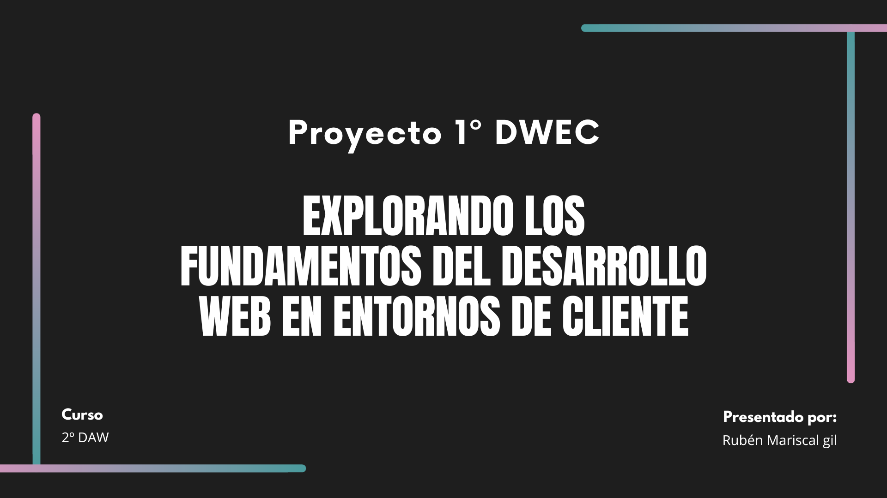

###### Rubén Mariscal Gil 2ºDAW

###### Proyecto 1 DWEC

# - *ÍNDICE* -

- ####  1. Modelos de Programación en Entornos Cliente/Servidor.
    - ***-** ¿Cuales son los modelos cliente/servidor más comunes?*
    - ***-** Identifica ejemplos de aplicaciones que utilizan cada modelo.*

- #### 2. Mecanismos de Ejecución de Código en un Navegador Web. Capacidades y Limitaciones de Ejecución. Compatibilidad con Navegadores Web.
    - ***-** ¿Cómo se ejecuta el código JavaScript en un navegador?*
    - ***-** Diferencias de compatibilidad entre navegadores.*
    - ***-** Resolución de problemas de compatibilidad en una aplicación web.*

- #### 3. Lenguajes de Programación en Entorno Cliente.
    - ***-** Investigación de lenguajes como JavaScript, TypeScript, y otros.*
    - ***-** Comparación de sus características y aplicaciones.*

- ### 4. Características de los Lenguajes de Script. Ventajas y Desventajas.
    - ***-** Análisis de las ventajas y desventajas de la programación en lenguajes de script sobre la programación tradicional.*

- ### 5. Tecnologías y Lenguajes Asociados. Integración del Código con las Etiquetas HTML.
    - ***-** Exploración de tecnologías como CSS y HTML5.*
    - ***-** Creación de una pequeña aplicación web integrando código JavaScript de diferentes maneras.*

- ### 6. Herramientas de Programación.
    - ***-** Uso de herramientas como Visual Studio Code, Chrome DevTools, etc.*

---